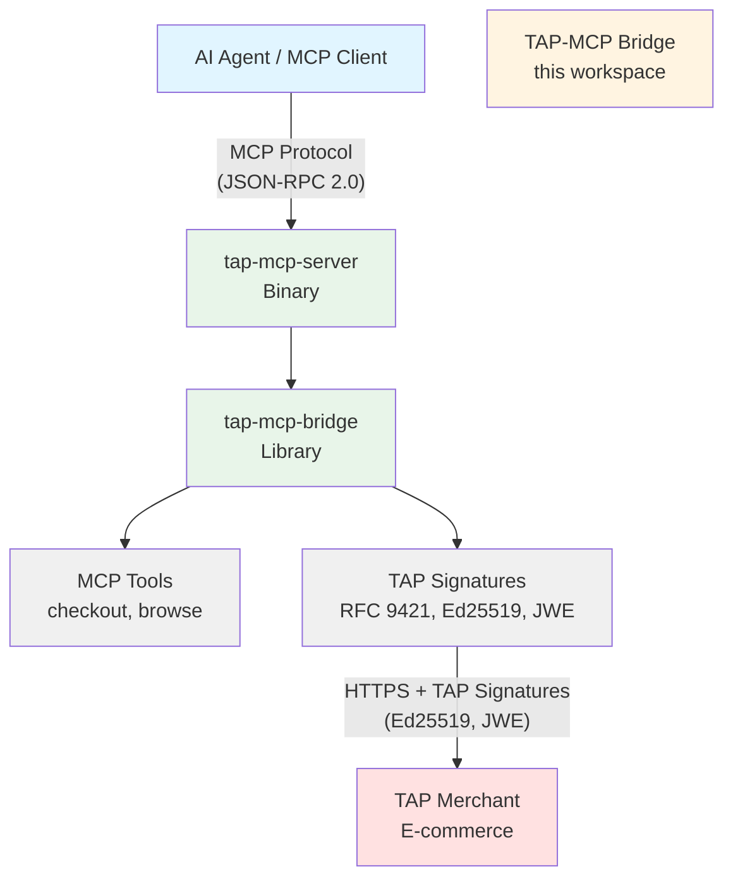

# TAP-MCP Bridge

**Production-ready Rust library and MCP server** for Visa's Trusted Agent Protocol (TAP), enabling AI agents to securely authenticate with merchants and execute payment transactions.

[](https://crates.io/crates/tap-mcp-bridge)
[](LICENSE)
[](https://www.rust-lang.org)
[](docs/TAP_SPECIFICATION.md)
[](#testing)
[](#project-structure)

---

## 📋 Table of Contents

- [Overview](#overview)
- [Quick Start](#-quick-start) ⚡
- [Installation](#-installation)
- [Features](#-features)
- [Architecture](#-architecture)
- [Examples](#-examples)
- [Documentation](#-documentation)
- [Development](#-development)
- [Security](#-security)
- [Testing](#-testing)

---

## Overview

The TAP-MCP Bridge acts as a **protocol adapter**, translating between:

- **MCP layer**: Application-layer tool calls (JSON-RPC 2.0 over stdio/HTTP)
- **TAP layer**: Transport-layer cryptographic authentication (RFC 9421 HTTP Message Signatures)

### What Can AI Agents Do?

✅ Authenticate with TAP-protected merchants using Ed25519 cryptographic signatures
✅ Execute secure payment transactions with PCI-DSS compliant encryption
✅ Browse merchant catalogs with verified agent identity
✅ Maintain session state across multi-step interactions

### Production Status

| Metric | Status |
|--------|--------|
| **TAP Compliance** | 100% (18/18 requirements) |
| **Test Coverage** | 128 tests passing (110 unit + 18 binary) |
| **Security** | PCI-DSS compliant, RFC 7516 JWE encryption |
| **Code Quality** | 0 warnings, Microsoft Rust Guidelines compliant |
| **Platform Support** | macOS, Linux, Windows |

---

## ⚡ Quick Start

### For MCP Client Users

**1. Install the MCP server:**

```bash
cargo install --path tap-mcp-server
```

**2. Configure your MCP client** (config file location varies by client):

```json
{
  "mcpServers": {
    "tap": {
      "command": "tap-mcp-server",
      "env": {
        "TAP_AGENT_ID": "your-agent-id",
        "TAP_AGENT_DIRECTORY": "https://your-agent-directory.com",
        "TAP_SIGNING_KEY": "0123456789abcdef0123456789abcdef0123456789abcdef0123456789abcdef"
      }
    }
  }
}
```

**3. Start your MCP client** - The TAP server will be available with three tools:
- `checkout_with_tap` - Execute payment with TAP authentication
- `browse_merchant` - Browse merchant catalog
- `verify_agent_identity` - Health check and agent verification

### For Rust Developers

**Add to your `Cargo.toml`:**

```toml
[dependencies]
tap-mcp-bridge = "0.1.0"
ed25519-dalek = "2.2"
tokio = { version = "1.48", features = ["rt", "macros"] }
```

**Execute a TAP checkout:**

```rust
use ed25519_dalek::SigningKey;
use tap_mcp_bridge::{
    mcp::{checkout_with_tap, CheckoutParams},
    tap::TapSigner,
};

#[tokio::main]
async fn main() -> Result<(), Box<dyn std::error::Error>> {
    // Initialize TAP signer
    let signing_key = SigningKey::from_bytes(&[0u8; 32]);
    let signer = TapSigner::new(
        signing_key,
        "agent-123",
        "https://agent.example.com"
    );

    // Execute checkout
    let params = CheckoutParams {
        merchant_url: "https://merchant.example.com".to_string(),
        consumer_id: "user-456".to_string(),
        intent: "payment".to_string(),
        payment_method: None,
        merchant_public_key: None,
    };

    let result = checkout_with_tap(&signer, params).await?;
    println!("Transaction status: {}", result.status);
    Ok(())
}
```

**Run examples:**

```bash
cargo run --example basic_checkout
cargo run --example apc_generation
cargo run --example browse_catalog
```

---

## 📦 Installation

### Project Structure

This is a **Cargo workspace** with two crates:

```
tap-mcp-bridge/
├── tap-mcp-bridge/    # 📚 Library - TAP protocol implementation
└── tap-mcp-server/    # 🔧 Binary - MCP server for AI agents
```

### As a Library

Add to your `Cargo.toml`:

```toml
[dependencies]
tap-mcp-bridge = "0.1.0"
ed25519-dalek = "2.2"  # For signing key generation
```

### As a Binary (MCP Server)

**Option 1: Install from source**

```bash
git clone https://github.com/bug-ops/tap-mcp-bridge.git
cd tap-mcp-bridge
cargo install --path tap-mcp-server
```

**Option 2: Build locally**

```bash
cargo build --release --bin tap-mcp-server
# Binary location: ./target/release/tap-mcp-server
```

### Environment Variables

| Variable | Required | Format | Example |
|----------|----------|--------|---------|
| `TAP_AGENT_ID` | ✅ Yes | Alphanumeric + `-_` (1-64 chars) | `agent-123` |
| `TAP_AGENT_DIRECTORY` | ✅ Yes | HTTPS URL | `https://agent.example.com` |
| `TAP_SIGNING_KEY` | ✅ Yes | 64 hex characters (32 bytes) | `0123...` |
| `RUST_LOG` | ❌ No | Log level | `info` (default) |

### Troubleshooting

<details>
<summary><b>Missing environment variable</b></summary>

```
Error: TAP_AGENT_ID environment variable is required
```

**Solution**: Set all required environment variables in your MCP client config

</details>

<details>
<summary><b>Invalid signing key</b></summary>

```
Error: TAP_SIGNING_KEY must be exactly 64 hex characters
```

**Solution**: Generate a valid Ed25519 key and encode as hex (64 chars)

```bash
# Generate key (example - use secure key management in production)
openssl genpkey -algorithm Ed25519 -out private.pem
# Convert to hex format (64 chars)
```

</details>

<details>
<summary><b>Invalid URL</b></summary>

```
Error: TAP_AGENT_DIRECTORY must be an HTTPS URL
```

**Solution**: Use HTTPS URL (not HTTP) for agent directory

</details>

---

## ✨ Features

### TAP Protocol Compliance (100%)

| Feature | RFC | Status |
|---------|-----|--------|
| HTTP Message Signatures | [RFC 9421](https://www.rfc-editor.org/rfc/rfc9421.html) | ✅ Ed25519 |
| JWK Thumbprint | [RFC 7638](https://www.rfc-editor.org/rfc/rfc7638.html) | ✅ SHA-256 |
| Content-Digest | [RFC 9530](https://www.rfc-editor.org/rfc/rfc9530.html) | ✅ SHA-256 |
| JWE Encryption | [RFC 7516](https://www.rfc-editor.org/rfc/rfc7516.html) | ✅ A256GCM + RSA-OAEP-256 |
| Signature Expiration | TAP Spec | ✅ 8-minute window |
| Replay Protection | TAP Spec | ✅ UUID v4 nonce |
| Interaction Type Tags | TAP Spec | ✅ `agent-browser-auth`, `agent-payer-auth` |
| Public Key Directory | TAP Spec | ✅ JWKS endpoint |
| ID Token (JWT) | TAP Spec | ✅ Consumer authentication |
| ACRO | TAP Spec | ✅ Consumer Recognition Object |
| APC | TAP Spec | ✅ Payment Container with JWE |

### Security Features

🔒 **PCI-DSS Compliance** - JWE encryption for payment data (A256GCM + RSA-OAEP-256)
🔒 **Defense-in-Depth** - Application-level JWE + transport-level TLS
🔒 **Memory Safety** - Automatic zeroization of sensitive data
🔒 **Type Safety** - Rust's ownership model prevents cryptographic errors
🔒 **Input Validation** - HTTPS-only URLs, consumer ID format validation
🔒 **Secure Key Management** - No plaintext secrets in logs or errors

### Development Features

⚡ **Async/Await** - Built on Tokio for concurrent operations
📚 **Comprehensive Documentation** - Rustdoc with examples for all public APIs
🎯 **Type-Safe Errors** - Context-rich errors via `thiserror`
🧪 **Extensive Testing** - 122 automated tests (104 unit + 18 binary)
✅ **Zero Warnings** - Strict clippy lints enforced
🌍 **Cross-Platform** - Works on macOS, Linux, Windows

### Observability Features

📊 **Structured Logging** - JSON or pretty-printed logs with contextual fields
🔍 **Request Correlation** - Automatic span tracking for all operations
❤️ **Health Checks** - Built-in health verification via MCP tool
📈 **Instrumentation** - Distributed tracing-compatible spans
🎯 **Contextual Fields** - merchant_url, consumer_id, nonce, interaction_type in all logs

---

## 🏗 Architecture



### Key Components

1. **MCP Server** (`tap-mcp-server`) - Standalone binary exposing TAP as MCP tools
2. **Protocol Adapter** - Translates between MCP and TAP protocols
3. **TAP Client** - Generates RFC 9421 HTTP Message Signatures with Ed25519
4. **Cryptographic Engine** - JWE encryption, signature generation, key management

### Workspace Architecture

The project uses a **clean separation** between library and binary:

| Crate | Purpose | Dependencies |
|-------|---------|--------------|
| `tap-mcp-bridge` | Reusable TAP protocol library | Lean (TAP protocol only) |
| `tap-mcp-server` | MCP server for AI agents | Rich (logging, CLI, error handling) |

**Benefits:**
- Library consumers don't pull unnecessary binary dependencies
- Binary can use `anyhow`, `tracing-subscriber`, `clap` independently
- Clear separation: reusable logic vs application

---

## 📚 Examples

The [`examples/`](tap-mcp-bridge/examples/) directory contains complete working examples:

| Example | Description |
|---------|-------------|
| [basic_checkout.rs](tap-mcp-bridge/examples/basic_checkout.rs) | Simple checkout flow with error handling |
| [browse_catalog.rs](tap-mcp-bridge/examples/browse_catalog.rs) | Browsing merchant catalogs |
| [apc_generation.rs](tap-mcp-bridge/examples/apc_generation.rs) | Payment container with JWE encryption |
| [acro_generation.rs](tap-mcp-bridge/examples/acro_generation.rs) | Consumer recognition object |
| [signature_generation.rs](tap-mcp-bridge/examples/signature_generation.rs) | Low-level TAP signatures |
| [jwks_generation.rs](tap-mcp-bridge/examples/jwks_generation.rs) | Public key directory |
| [id_token_generation.rs](tap-mcp-bridge/examples/id_token_generation.rs) | JWT ID tokens |

### Example: Payment with Card

```rust
use tap_mcp_bridge::tap::{
    TapSigner,
    apc::{CardData, PaymentMethod, RsaPublicKey},
};

// Create payment method
let card = CardData {
    number: "4111111111111111".to_owned(),
    exp_month: "12".to_owned(),
    exp_year: "25".to_owned(),
    cvv: "123".to_owned(),
    cardholder_name: "John Doe".to_owned(),
};

// Load merchant's public key
let merchant_pem = std::fs::read("merchant_key.pem")?;
let merchant_key = RsaPublicKey::from_pem(&merchant_pem)?;

// Generate APC with JWE-encrypted payment data
let nonce = uuid::Uuid::new_v4().to_string();
let apc = signer.generate_apc(&nonce, &PaymentMethod::Card(card), &merchant_key)?;

println!("Payment data encrypted with JWE");
```

### Run Examples

```bash
# Basic checkout flow
cargo run --example basic_checkout

# Payment container with JWE
cargo run --example apc_generation

# Browse merchant catalog
cargo run --example browse_catalog

# All examples
cargo run --example signature_generation
cargo run --example acro_generation
cargo run --example jwks_generation
```

---

## 📖 Documentation

### API Documentation

Generate and view the full API documentation:

```bash
cargo doc --no-deps --all-features --open
```

### Specification Guides

| Guide | Description |
|-------|-------------|
| [TAP Specification](docs/TAP_SPECIFICATION.md) | Detailed TAP protocol implementation guide |
| [MCP Integration](docs/MCP_INTEGRATION.md) | MCP protocol and tool integration |
| [Observability Guide](docs/OBSERVABILITY.md) | Logging, monitoring, and health checks |
| [Library Overview](tap-mcp-bridge/src/lib.rs) | Architecture overview and integration guide |
| [Error Types](tap-mcp-bridge/src/error.rs) | All error variants with recovery strategies |

### Testing Documentation

Comprehensive testing analysis available in `.local/`:
- `TESTING_INDEX.md` - Navigation guide
- `testing-summary-phase6.md` - Executive summary
- `testing-report-phase6.md` - Detailed 10,000+ word analysis

---

## 🛠 Development

### Prerequisites

- **Rust** 1.75+ (Edition 2024)
- **Cargo**
- **Optional**: `cargo-make`, `cargo-nextest`, `cargo-deny`

### Setup

```bash
# Clone the repository
git clone https://github.com/bug-ops/tap-mcp-bridge.git
cd tap-mcp-bridge

# Install development tools (recommended)
cargo install cargo-make cargo-nextest cargo-deny cargo-udeps
```

### Performance: sccache for 10x Faster Builds ⚡

Enable `sccache` for dramatically faster incremental builds:

```bash
# Install sccache
cargo install sccache

# Configure Cargo (~/.cargo/config.toml)
[build]
rustc-wrapper = "sccache"

[env]
SCCACHE_CACHE_SIZE = { value = "10G", force = true }
```

**Results:**
- First build: ~22s
- Cached rebuild: ~2-3s (10x faster!)

### Common Commands

**Using cargo-make** (recommended):

```bash
# Quick pre-commit checks (format, clippy, test, deny)
cargo make pre-commit

# Full verification suite
cargo make verify

# Individual tasks
cargo make format        # Format with nightly rustfmt
cargo make clippy        # Strict lint checks
cargo make test          # Run tests with nextest
cargo make deny          # Security and license checks
cargo make doc-open      # Build and open docs
```

**Direct cargo commands**:

```bash
# Build workspace
cargo build --workspace

# Run tests (109 passing)
cargo nextest run --workspace --all-features
cargo test --doc --workspace

# Code quality
cargo clippy --workspace --all-features -- -D warnings
cargo +nightly fmt --all

# Security checks
cargo deny check
cargo audit
cargo +nightly udeps --all-targets

# Build binary
cargo build --release --bin tap-mcp-server
```

### Code Quality Standards

This project follows the **[Microsoft Rust Guidelines](https://microsoft.github.io/rust-guidelines/)** for soundness and idiomatic design.

**Key principles:**

✅ **No unsafe code** - 100% safe Rust
✅ **Strong types** - Domain-specific types instead of primitives
✅ **Comprehensive error handling** - Context-rich errors with recovery guidance
✅ **API Guidelines compliance** - Following [Rust API Guidelines](https://rust-lang.github.io/api-guidelines/)
✅ **Zero warnings** - Strict clippy lints enforced

---

## 🔒 Security

### Payment Data Handling

| Security Layer | Implementation |
|----------------|----------------|
| **Encryption Algorithm** | A256GCM (content) + RSA-OAEP-256 (key) |
| **Standard Compliance** | PCI-DSS, RFC 7516 JWE |
| **Defense Strategy** | Application-level JWE + TLS transport |
| **Memory Safety** | Automatic zeroization (card numbers, CVV) |
| **Logging** | Payment data never logged or in errors |

### TAP Security Features

| Feature | Implementation |
|---------|----------------|
| **Signature Expiration** | 8-minute validity window (TAP requirement) |
| **Replay Protection** | Unique UUID v4 nonce per request |
| **Timestamp Validation** | Created/expires enforce time windows |
| **URL Validation** | HTTPS-only, no localhost |
| **Input Sanitization** | Consumer IDs, URLs, payment data validated |
| **Nonce Correlation** | Same nonce across signature, ID token, ACRO, APC |

### Key Management Best Practices

🔑 **Private Keys**: Store Ed25519 signing keys securely (HSM, KMS, encrypted vault)
🔑 **Public Keys**: Distribute via HTTPS-only JWKS endpoint
🔑 **Key Rotation**: Supported through JWKS updates
🔑 **Key Identification**: JWK Thumbprint (RFC 7638) for each key

### Security Audits

- ✅ `cargo deny check` - No security advisories
- ✅ `cargo audit` - No known vulnerabilities
- ✅ All dependencies from trusted sources (crates.io)
- ✅ License compliance verified

---

## 🧪 Testing

### Quick Test Commands

```bash
# Run all tests (109 tests, 100% passing)
cargo nextest run --workspace --all-features

# Run doc tests
cargo test --doc --workspace

# Run with coverage
cargo llvm-cov nextest --workspace --all-features

# Test specific module
cargo nextest run --workspace tap::apc
```

### What's Tested

✅ **TAP Protocol Compliance** - RFC 9421, RFC 7638, RFC 7516 validation
✅ **Cryptographic Operations** - Signature generation, JWE encryption
✅ **Security Controls** - Input validation, HTTPS enforcement, URL sanitization
✅ **Binary Configuration** - Environment variable validation
✅ **Error Handling** - All error paths covered

See [`.local/TESTING_INDEX.md`](.local/TESTING_INDEX.md) for detailed testing documentation.

---

## 🤝 Contributing

Contributions are welcome! Before contributing:

1. Review the architecture in [library documentation](tap-mcp-bridge/src/lib.rs)
2. Check [TAP Specification](docs/TAP_SPECIFICATION.md) for protocol details
3. Ensure all tests pass: `cargo nextest run --workspace`
4. Run quality checks: `cargo make verify`
5. Format code: `cargo +nightly fmt --all`

### Pull Request Process

1. Create a feature branch
2. Implement changes with tests
3. Run `cargo make pre-commit`
4. Open PR with description

---

## 📄 License

Licensed under either of:

- **Apache License, Version 2.0** ([LICENSE-APACHE](LICENSE-APACHE) or http://www.apache.org/licenses/LICENSE-2.0)
- **MIT license** ([LICENSE-MIT](LICENSE-MIT) or http://opensource.org/licenses/MIT)

at your option.

---

## 🔗 Resources

### TAP Protocol

- [TAP Specification](https://developer.visa.com/capabilities/trusted-agent-protocol/) - Official Visa documentation
- [Visa Reference Implementation](https://github.com/visa/trusted-agent-protocol) - Python reference code
- [TAP Implementation Guide](docs/TAP_SPECIFICATION.md) - This project's comprehensive guide

### RFCs

- [RFC 9421](https://www.rfc-editor.org/rfc/rfc9421.html) - HTTP Message Signatures
- [RFC 7638](https://www.rfc-editor.org/rfc/rfc7638.html) - JWK Thumbprint
- [RFC 7516](https://www.rfc-editor.org/rfc/rfc7516.html) - JSON Web Encryption (JWE)
- [RFC 9530](https://www.rfc-editor.org/rfc/rfc9530.html) - Digest Fields
- [RFC 8032](https://www.rfc-editor.org/rfc/rfc8032.html) - Ed25519 Signature Algorithm

### MCP Protocol

- [MCP Documentation](https://modelcontextprotocol.io/) - Anthropic's Model Context Protocol
- [MCP Integration Guide](docs/MCP_INTEGRATION.md) - This project's integration guide
- [rmcp Crate](https://crates.io/crates/rmcp) - Rust MCP SDK

### Rust Resources

- [Microsoft Rust Guidelines](https://microsoft.github.io/rust-guidelines/) - Soundness and best practices
- [Rust API Guidelines](https://rust-lang.github.io/api-guidelines/) - API design patterns
- [Edition 2024 Guide](https://doc.rust-lang.org/edition-guide/rust-2024/) - Latest Rust edition

---

<div align="center">

**Built with ❤️ using Rust Edition 2024**

[Report Bug](https://github.com/bug-ops/tap-mcp-bridge/issues) · [Request Feature](https://github.com/bug-ops/tap-mcp-bridge/issues) · [Documentation](https://github.com/bug-ops/tap-mcp-bridge/tree/master/docs)

</div>
