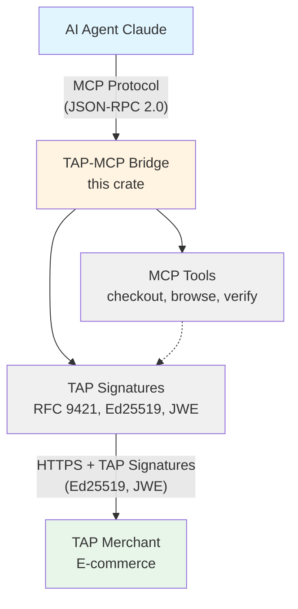

# TAP-MCP Bridge

A production-ready Rust library that bridges Visa's Trusted Agent Protocol (TAP) with Anthropic's Model Context Protocol (MCP), enabling AI agents like Claude to securely authenticate with merchants and execute payment transactions.

[](LICENSE)
[](https://www.rust-lang.org)
[](docs/TAP_SPECIFICATION.md)

## Overview

The TAP-MCP Bridge acts as a protocol adapter, translating between:

- **MCP layer**: Application-layer tool calls (JSON-RPC 2.0 over stdio/HTTP)
- **TAP layer**: Transport-layer cryptographic authentication (RFC 9421 HTTP Message Signatures)

This enables AI agents to:
- ✅ Authenticate with TAP-protected merchants using Ed25519 cryptographic signatures
- ✅ Execute secure payment transactions with PCI-DSS compliant encryption
- ✅ Browse merchant catalogs with verified agent identity
- ✅ Maintain session state across multi-step interactions

## Status: Production Ready ✅

**TAP Compliance**: 100% (18/18 requirements)
**Algorithm Correctness**: 100% vs Visa reference implementation
**Test Coverage**: 155 tests (100% passing)
**Security**: PCI-DSS compliant with RFC 7516 JWE encryption

## Architecture



### Key Components

1. **MCP Server Wrapper** - Exposes TAP operations as MCP tools
2. **Protocol Adapter** - Translates between MCP and TAP protocols
3. **TAP Client** - Generates RFC 9421 HTTP Message Signatures with Ed25519
4. **Cryptographic Engine** - JWE encryption, signature generation, key management

## Features

### TAP Protocol Compliance

- ✅ **RFC 9421 HTTP Message Signatures** with Ed25519
- ✅ **JWK Thumbprint** key identifiers (RFC 7638)
- ✅ **Content-Digest** header (RFC 9530, SHA-256)
- ✅ **Signature Expiration** (8-minute maximum validity window)
- ✅ **Replay Protection** (unique nonce per request, UUID v4)
- ✅ **Interaction Type Tags** (`agent-browser-auth`, `agent-payer-auth`)
- ✅ **Public Key Directory** (JWKS at `/.well-known/http-message-signatures-directory`)
- ✅ **ID Token** (JWT) generation for consumer authentication
- ✅ **ACRO** (Agentic Consumer Recognition Object)
- ✅ **APC** (Agentic Payment Container) with **RFC 7516 JWE encryption**

### Security Features

- ✅ **PCI-DSS Compliance**: JWE encryption for payment data (A256GCM + RSA-OAEP-256)
- ✅ **Defense-in-Depth**: Application-level JWE + transport-level TLS
- ✅ **Memory Safety**: Automatic zeroization of sensitive data
- ✅ **Type Safety**: Rust's ownership model prevents cryptographic errors
- ✅ **Input Validation**: HTTPS-only URLs, consumer ID format validation
- ✅ **Secure Key Management**: No plaintext secrets in logs or errors

### Development Features

- ✅ **Async/Await**: Built on Tokio for concurrent operations
- ✅ **Comprehensive Documentation**: Rustdoc with examples for all public APIs
- ✅ **Type-Safe Errors**: Context-rich errors via `thiserror`
- ✅ **Extensive Testing**: 155 automated tests (104 unit + 51 doc)
- ✅ **Zero Warnings**: Strict clippy lints enforced

## Installation

This project uses a Cargo workspace with two crates:

- **`tap-mcp-bridge`** - Library crate with TAP protocol implementation
- **`tap-mcp-server`** - Binary crate for Claude Desktop integration

### As a Library

Add this to your `Cargo.toml`:

```toml
[dependencies]
tap-mcp-bridge = "0.1.0"
ed25519-dalek = "2.2"  # For signing key generation
```

### As a Binary (Claude Desktop)

Build and install the MCP server:

```bash
# Build release binary
cargo build --release --bin tap-mcp-server

# Or install to cargo bin directory
cargo install --path tap-mcp-server
```

#### Configuration

The server requires three environment variables:

- **`TAP_AGENT_ID`** (required) - Your agent identifier
  - Format: Alphanumeric + hyphens/underscores
  - Length: 1-64 characters
  - Example: `agent-123`

- **`TAP_AGENT_DIRECTORY`** (required) - Your agent directory URL
  - Format: Must be HTTPS URL
  - Example: `https://agent.example.com`

- **`TAP_SIGNING_KEY`** (required) - Ed25519 private key
  - Format: 64 hexadecimal characters (32 bytes)
  - Example: `0123456789abcdef...` (64 hex chars)

- **`RUST_LOG`** (optional) - Log level
  - Default: `info`
  - Options: `error`, `warn`, `info`, `debug`, `trace`

#### Claude Desktop Integration

Add to your `claude_desktop_config.json`:

```json
{
  "mcpServers": {
    "tap": {
      "command": "tap-mcp-server",
      "env": {
        "TAP_AGENT_ID": "your-agent-id",
        "TAP_AGENT_DIRECTORY": "https://your-agent-directory.com",
        "TAP_SIGNING_KEY": "0123456789abcdef0123456789abcdef0123456789abcdef0123456789abcdef",
        "RUST_LOG": "info"
      }
    }
  }
}
```

#### Available Tools

The MCP server exposes two tools to Claude:

1. **`checkout_with_tap`** - Execute a payment checkout with TAP authentication
   - Parameters: merchant_url, consumer_id, intent, country_code, zip, ip_address, user_agent, platform
   - Returns: Transaction status and merchant response

2. **`browse_merchant`** - Browse merchant catalog with verified agent identity
   - Parameters: merchant_url, consumer_id, country_code, zip, ip_address, user_agent, platform
   - Returns: Catalog data or merchant response

#### Troubleshooting

**Missing environment variable:**
```
Error: TAP_AGENT_ID environment variable is required
```
Solution: Set all required environment variables in Claude Desktop config

**Invalid signing key:**
```
Error: TAP_SIGNING_KEY must be exactly 64 hex characters
```
Solution: Generate a valid Ed25519 key and encode as hex (64 chars)

**Invalid URL:**
```
Error: TAP_AGENT_DIRECTORY must be an HTTPS URL
```
Solution: Use HTTPS URL (not HTTP) for agent directory

## Quick Start

### 1. Basic Checkout with Payment

```rust
use ed25519_dalek::SigningKey;
use tap_mcp_bridge::{
    mcp::{checkout_with_tap, CheckoutParams},
    tap::{TapSigner, apc::{CardData, PaymentMethod, RsaPublicKey}},
};

#[tokio::main]
async fn main() -> Result<(), Box<dyn std::error::Error>> {
    // Initialize TAP signer with agent credentials
    let signing_key = SigningKey::from_bytes(&[0u8; 32]);
    let signer = TapSigner::new(
        signing_key,
        "agent-123",
        "https://agent.example.com"
    );

    // Create payment method (card)
    let card = CardData {
        number: "4111111111111111".to_owned(),
        exp_month: "12".to_owned(),
        exp_year: "25".to_owned(),
        cvv: "123".to_owned(),
        cardholder_name: "John Doe".to_owned(),
    };

    // Load merchant's public key for payment encryption
    let merchant_pem = std::fs::read("merchant_public_key.pem")?;
    let merchant_key = RsaPublicKey::from_pem(&merchant_pem)?;

    // Configure checkout parameters
    let params = CheckoutParams {
        merchant_url: "https://merchant.example.com".to_string(),
        consumer_id: "user-456".to_string(),
        intent: "payment".to_string(),
        payment_method: Some(PaymentMethod::Card(card)),
        merchant_public_key: Some(merchant_key),
    };

    // Execute checkout with TAP authentication
    let result = checkout_with_tap(&signer, params).await?;
    println!("Transaction completed: {}", result.status);

    Ok(())
}
```

### 2. Browse Merchant Catalog

```rust
use tap_mcp_bridge::{
    mcp::{browse_merchant, BrowseParams},
    tap::TapSigner,
};

#[tokio::main]
async fn main() -> Result<(), Box<dyn std::error::Error>> {
    let signer = TapSigner::new(/* ... */);

    let params = BrowseParams {
        merchant_url: "https://merchant.example.com/catalog".to_string(),
        consumer_id: "user-456".to_string(),
    };

    let result = browse_merchant(&signer, params).await?;
    println!("Available products: {}", result.data);

    Ok(())
}
```

### 3. Generate APC (Agentic Payment Container)

```rust
use tap_mcp_bridge::tap::{
    TapSigner,
    apc::{CardData, PaymentMethod, RsaPublicKey},
};

#[tokio::main]
async fn main() -> Result<(), Box<dyn std::error::Error>> {
    let signer = TapSigner::new(/* ... */);

    // Create payment method
    let card = CardData { /* ... */ };
    let payment = PaymentMethod::Card(card);

    // Load merchant's public key
    let merchant_pem = std::fs::read("merchant_key.pem")?;
    let merchant_key = RsaPublicKey::from_pem(&merchant_pem)?;

    // Generate APC with JWE-encrypted payment data
    let nonce = uuid::Uuid::new_v4().to_string();
    let apc = signer.generate_apc(&nonce, &payment, &merchant_key)?;

    println!("APC created with encrypted payment data");
    println!("JWE format: {}", apc.encrypted_payment_data);

    Ok(())
}
```

## Examples

The [`examples/`](examples/) directory contains complete working examples:

- **[basic_checkout.rs](examples/basic_checkout.rs)** - Simple checkout flow with error handling
- **[browse_catalog.rs](examples/browse_catalog.rs)** - Browsing merchant catalogs
- **[apc_generation.rs](examples/apc_generation.rs)** - Payment container with JWE encryption
- **[signature_generation.rs](examples/signature_generation.rs)** - Low-level TAP signatures

Run examples:

```bash
cargo run --example basic_checkout
cargo run --example apc_generation
```

## Documentation

### API Documentation

Generate and view the full API documentation:

```bash
cargo doc --no-deps --all-features --open
```

### Specification Guides

- **[TAP Specification](docs/TAP_SPECIFICATION.md)** - Detailed TAP protocol implementation guide
- **[MCP Integration](docs/MCP_INTEGRATION.md)** - MCP protocol and tool integration
- **[Main Library Docs](src/lib.rs)** - Architecture overview and integration guide
- **[Error Types](src/error.rs)** - All error variants with recovery strategies

## Development

### Prerequisites

- Rust 1.75+ (Edition 2024)
- Cargo
- Optional: `cargo-make`, `cargo-nextest`, `cargo-deny`

### Setup

```bash
# Clone the repository
git clone https://github.com/bug-ops/tap-mcp-bridge.git
cd tap-mcp-bridge

# Install development tools (optional but recommended)
cargo install cargo-make cargo-nextest cargo-deny cargo-udeps
```

### Performance: Enable sccache for 10x Faster Builds

Install and configure sccache for dramatically faster incremental builds:

```bash
# Install sccache
cargo install sccache

# Configure Cargo (add to ~/.cargo/config.toml)
mkdir -p ~/.cargo
cat >> ~/.cargo/config.toml << 'EOF'

[build]
rustc-wrapper = "sccache"
incremental = true

[env]
SCCACHE_DIR = { value = "~/.cache/sccache", force = true }
SCCACHE_CACHE_SIZE = { value = "10G", force = true }
EOF

# Verify - rebuild is 10x faster!
cargo clean && cargo build --release  # ~22s first time
cargo clean && cargo build --release  # ~2-3s second time (cached)
```

### Common Commands

**Using cargo-make** (recommended):

```bash
# Quick pre-commit checks
cargo make pre-commit

# Full verification
cargo make verify

# Individual tasks
cargo make format      # Format with nightly rustfmt
cargo make clippy      # Strict lint checks
cargo make test        # Run tests with nextest
cargo make doc-open    # Build and open docs
```

**Direct cargo commands**:

```bash
# Build
cargo build

# Test (155 tests)
cargo nextest run --all-features
cargo test --doc --all-features

# Code quality
cargo clippy --all-targets --all-features -- -D warnings
cargo +nightly fmt --all

# Security checks
cargo deny check
cargo +nightly udeps --all-targets
```

### Code Quality Standards

This project follows the [Microsoft Rust Guidelines](https://microsoft.github.io/rust-guidelines/) for soundness and idiomatic design.

Key principles:
- **No unsafe code** - 100% safe Rust
- **Strong types** - Domain-specific types instead of primitives
- **Comprehensive error handling** - Context-rich errors with recovery guidance
- **API Guidelines compliance** - Following [Rust API Guidelines](https://rust-lang.github.io/api-guidelines/)
- **Zero warnings** - Strict clippy lints enforced

## Security

### Payment Data Handling

- **PCI-DSS Compliant**: Payment credentials encrypted with RFC 7516 JWE
- **Encryption**: A256GCM content encryption + RSA-OAEP-256 key encryption
- **Defense-in-Depth**: Application-level JWE + transport-level TLS
- **Memory Safety**: Automatic zeroization of card numbers, CVV, etc.
- **No Plaintext**: Payment data never logged or exposed in errors

### TAP Security Features

- **Signature Expiration**: Requests expire after 8 minutes (TAP requirement)
- **Replay Protection**: Unique nonce (UUID v4) per request
- **Timestamp Validation**: Created/expires parameters enforce time windows
- **HTTPS Only**: All merchant URLs validated (no localhost)
- **Input Validation**: Consumer IDs, URLs, payment data sanitized
- **Nonce Correlation**: Same nonce across signature, ID token, ACRO, APC

### Key Management

- **Private Keys**: Ed25519 signing keys must be stored securely (HSM, KMS, encrypted vault)
- **Public Keys**: Distributed via HTTPS-only JWKS endpoint
- **Key Rotation**: Supported through JWKS updates
- **Key Identification**: JWK Thumbprint (RFC 7638) for each key

## Testing

**Test Coverage**: 155 automated tests (100% passing)

- 104 unit and integration tests
- 51 documentation tests
- Signature generation and verification
- JWE encryption/decryption roundtrip
- ACRO and APC creation
- Nonce correlation validation
- Error handling and edge cases

Run tests:

```bash
# All tests
cargo nextest run --all-features

# Doc tests
cargo test --doc --all-features

# Specific module
cargo nextest run --all-features tap::apc
```

## Contributing

Contributions are welcome! Before contributing:

1. Review the architecture in [library documentation](src/lib.rs)
2. Check [TAP Specification](docs/TAP_SPECIFICATION.md) for protocol details
3. Ensure all tests pass: `cargo nextest run`
4. Run quality checks: `cargo make verify`
5. Format code: `cargo +nightly fmt`

## License

Licensed under either of:

- Apache License, Version 2.0 ([LICENSE-APACHE](LICENSE-APACHE) or http://www.apache.org/licenses/LICENSE-2.0)
- MIT license ([LICENSE-MIT](LICENSE-MIT) or http://opensource.org/licenses/MIT)

## Resources

### TAP Protocol
- **[TAP Specification](https://developer.visa.com/capabilities/trusted-agent-protocol/)**: Official Visa documentation
- **[Visa Reference Implementation](https://github.com/visa/trusted-agent-protocol)**: Python reference code
- **[TAP Implementation Guide](docs/TAP_SPECIFICATION.md)**: This project's TAP guide

### RFCs
- **[RFC 9421](https://www.rfc-editor.org/rfc/rfc9421.html)**: HTTP Message Signatures
- **[RFC 7638](https://www.rfc-editor.org/rfc/rfc7638.html)**: JWK Thumbprint
- **[RFC 7516](https://www.rfc-editor.org/rfc/rfc7516.html)**: JSON Web Encryption (JWE)
- **[RFC 9530](https://www.rfc-editor.org/rfc/rfc9530.html)**: Digest Fields
- **[RFC 8032](https://www.rfc-editor.org/rfc/rfc8032.html)**: Ed25519 Signature Algorithm

### MCP Protocol
- **[MCP Documentation](https://modelcontextprotocol.io/)**: Anthropic's Model Context Protocol
- **[MCP Integration Guide](docs/MCP_INTEGRATION.md)**: This project's MCP guide
- **[rmcp Crate](https://crates.io/crates/rmcp)**: Rust MCP SDK

### Rust
- **[Microsoft Rust Guidelines](https://microsoft.github.io/rust-guidelines/)**: Soundness and best practices
- **[Rust API Guidelines](https://rust-lang.github.io/api-guidelines/)**: API design patterns
