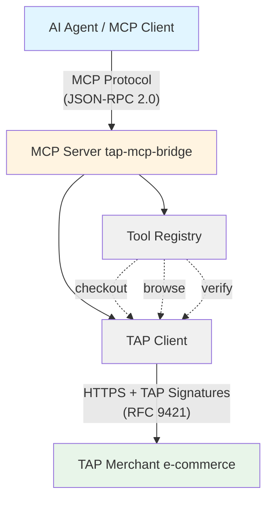
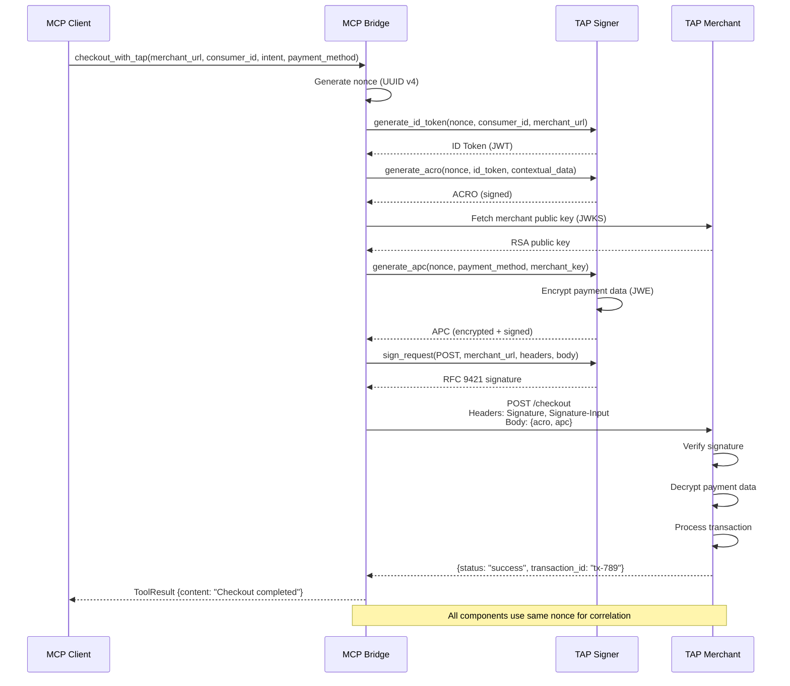
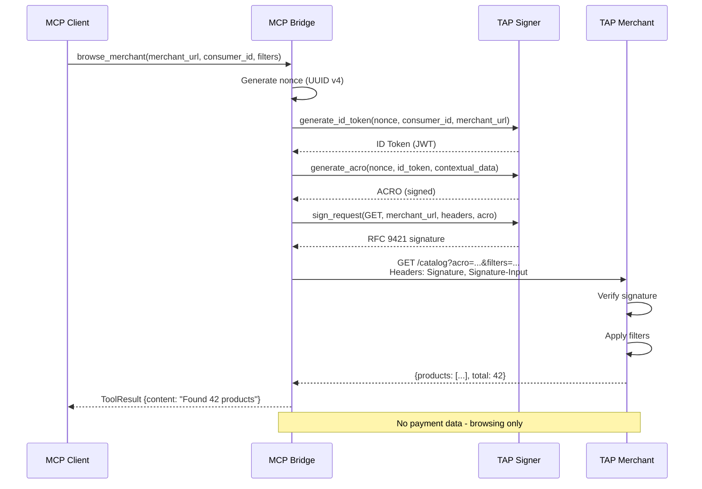

# MCP (Model Context Protocol) Integration

## Overview

The Model Context Protocol (MCP) is Anthropic's specification for enabling AI agents to integrate with external tools and services. This document describes how MCP is implemented in the tap-mcp-bridge project to expose TAP operations as agent-callable tools.

## MCP Architecture



## MCP Protocol Basics

### JSON-RPC 2.0

MCP uses JSON-RPC 2.0 for communication between agent and server:

**Request**:

```json
{
  "jsonrpc": "2.0",
  "id": 1,
  "method": "tools/call",
  "params": {
    "name": "checkout_with_tap",
    "arguments": {
      "merchant_url": "https://merchant.example.com",
      "consumer_id": "user-123",
      "intent": "payment"
    }
  }
}
```

**Response**:

```json
{
  "jsonrpc": "2.0",
  "id": 1,
  "result": {
    "content": [
      {
        "type": "text",
        "text": "Checkout completed successfully. Transaction ID: tx-789"
      }
    ]
  }
}
```

### Transport

MCP supports multiple transport mechanisms:

1. **stdio**: Standard input/output (used for local CLI tools)
2. **HTTP/SSE**: Server-Sent Events over HTTP (used for remote servers)

This bridge is designed as a library, allowing integration with either transport.

## MCP Tools

The bridge exposes three MCP tools for TAP operations:

### 1. checkout_with_tap

Execute a TAP-authenticated checkout transaction.

**Tool Definition**:

```json
{
  "name": "checkout_with_tap",
  "description": "Execute a checkout transaction with TAP authentication and payment processing",
  "inputSchema": {
    "type": "object",
    "properties": {
      "merchant_url": {
        "type": "string",
        "description": "HTTPS URL of the merchant's checkout endpoint"
      },
      "consumer_id": {
        "type": "string",
        "description": "Unique identifier for the consumer"
      },
      "intent": {
        "type": "string",
        "description": "Transaction intent (e.g., 'payment', 'authorization')"
      },
      "payment_method": {
        "type": "object",
        "description": "Payment credentials (card, bank account, or digital wallet)"
      }
    },
    "required": ["merchant_url", "consumer_id", "intent"]
  }
}
```

**Implementation**: `src/mcp/tools.rs::checkout_with_tap()`

**TAP Components Used**:

- HTTP Message Signature with `tag="agent-payer-auth"`
- ID Token (JWT) for consumer authentication
- ACRO (Agentic Consumer Recognition Object) with contextual data
- APC (Agentic Payment Container) with JWE-encrypted payment credentials

**Request Flow**:



### 2. browse_merchant

Browse merchant catalog with TAP authentication.

**Tool Definition**:

```json
{
  "name": "browse_merchant",
  "description": "Browse a merchant's catalog or product listings with TAP authentication",
  "inputSchema": {
    "type": "object",
    "properties": {
      "merchant_url": {
        "type": "string",
        "description": "HTTPS URL of the merchant's catalog endpoint"
      },
      "consumer_id": {
        "type": "string",
        "description": "Unique identifier for the consumer"
      },
      "filters": {
        "type": "object",
        "description": "Optional filters (category, price range, etc.)"
      }
    },
    "required": ["merchant_url", "consumer_id"]
  }
}
```

**Implementation**: `src/mcp/tools.rs::browse_merchant()`

**TAP Components Used**:

- HTTP Message Signature with `tag="agent-browser-auth"`
- ID Token (JWT) for consumer authentication
- ACRO (Agentic Consumer Recognition Object) with contextual data

**Request Flow**:



### 3. verify_agent_identity

Verify agent's TAP identity and key configuration.

**Tool Definition**:

```json
{
  "name": "verify_agent_identity",
  "description": "Verify agent's TAP identity, signing key, and JWKS endpoint availability",
  "inputSchema": {
    "type": "object",
    "properties": {},
    "required": []
  }
}
```

**Implementation**: `src/mcp/tools.rs::verify_agent_identity()`

**Verification Checks**:

- ✅ Agent ID is set and valid
- ✅ Signing key is loaded and functional
- ✅ JWK Thumbprint (kid) is computed correctly
- ✅ JWKS can be generated
- ✅ Directory URL is accessible (if deployed)

## Integration with TAP

### Protocol Adapter Pattern

The bridge acts as a protocol adapter, translating between MCP's tool-based model and TAP's signature-based authentication:

```rust
// MCP Tool Call (from agent)
let mcp_request = ToolCall {
    name: "checkout_with_tap",
    arguments: {
        merchant_url: "https://merchant.example.com",
        consumer_id: "user-123",
        intent: "payment"
    }
};

// Convert to TAP Request
async fn checkout_with_tap(signer: &TapSigner, params: CheckoutParams) -> Result<ToolResult> {
    // 1. Generate nonce
    let nonce = uuid::Uuid::new_v4().to_string();

    // 2. Create TAP components
    let id_token = signer.generate_id_token(&nonce, &params.consumer_id, &params.merchant_url)?;
    let acro = signer.generate_acro(&nonce, &id_token, &contextual_data)?;
    let apc = signer.generate_apc(&nonce, &payment_method, &merchant_public_key)?;

    // 3. Sign HTTP request
    let signature = signer.sign_request(
        "POST",
        &params.merchant_url,
        &headers,
        &body
    ).await?;

    // 4. Execute request
    let response = http_client.post(&params.merchant_url)
        .headers(signature.headers)
        .json(&json!({ "acro": acro, "apc": apc }))
        .send()
        .await?;

    // 5. Convert response to MCP format
    Ok(ToolResult {
        content: vec![
            Content::text(format!("Checkout completed: {:?}", response.json()))
        ]
    })
}
```

### Error Handling

MCP errors are mapped from TAP errors:

```rust
pub enum BridgeError {
    // TAP-specific errors
    SignatureError(String),      → MCP: "TAP signature generation failed"
    InvalidMerchantUrl(String),  → MCP: "Invalid merchant URL"
    ReplayAttack,                → MCP: "Request nonce already used"

    // Network errors
    HttpError(reqwest::Error),   → MCP: "HTTP request failed"

    // MCP protocol errors
    McpError(rmcp::Error),       → MCP: protocol-level error
}
```

All errors are converted to MCP's standard error format:

```json
{
  "jsonrpc": "2.0",
  "id": 1,
  "error": {
    "code": -32000,
    "message": "TAP signature generation failed: invalid signing key"
  }
}
```

## MCP Server Implementation

### Library Design

The bridge is designed as a **library**, not a standalone server:

```rust
// src/mcp/mod.rs - Public API

pub use tools::{
    checkout_with_tap,
    browse_merchant,
    verify_agent_identity,
};

pub use rmcp::{Server, Transport};
```

This allows developers to:

1. **Embed in existing applications**:

```rust
use tap_mcp_bridge::{
    mcp::{checkout_with_tap, CheckoutParams},
    tap::TapSigner,
};

// Use as library functions
let result = checkout_with_tap(&signer, params).await?;
```

2. **Create custom MCP servers**:

```rust
use rmcp::{Server, stdio::StdioTransport};
use tap_mcp_bridge::mcp::checkout_with_tap;

#[tokio::main]
async fn main() {
    let server = Server::new()
        .with_tool("checkout_with_tap", checkout_with_tap);

    server.run(StdioTransport::new()).await;
}
```

3. **Integrate with MCP clients**:

```json
{
  "mcpServers": {
    "tap-bridge": {
      "command": "tap-mcp-server",
      "args": ["--agent-id", "agent-123"],
      "env": {
        "TAP_SIGNING_KEY": "path/to/key.pem"
      }
    }
  }
}
```

### Tool Registration

Tools can be registered with the MCP server:

```rust
use rmcp::{Server, Tool, ToolDefinition};

let server = Server::new();

// Register checkout tool
server.register_tool(ToolDefinition {
    name: "checkout_with_tap".to_string(),
    description: "Execute TAP-authenticated checkout".to_string(),
    input_schema: checkout_schema(),
});

// Register browse tool
server.register_tool(ToolDefinition {
    name: "browse_merchant".to_string(),
    description: "Browse merchant catalog with TAP".to_string(),
    input_schema: browse_schema(),
});
```

## Security Considerations

### 1. Tool Input Validation

All MCP tool inputs are validated before TAP operations:

```rust
// Validate merchant URL (must be HTTPS, no localhost)
fn validate_merchant_url(url: &str) -> Result<()> {
    let parsed = Url::parse(url)?;

    if parsed.scheme() != "https" {
        return Err(BridgeError::InvalidMerchantUrl(
            "merchant URL must use HTTPS".to_string()
        ));
    }

    if parsed.host_str() == Some("localhost") || parsed.host_str() == Some("127.0.0.1") {
        return Err(BridgeError::InvalidMerchantUrl(
            "localhost URLs not allowed".to_string()
        ));
    }

    Ok(())
}

// Validate consumer ID (alphanumeric + hyphens/underscores, max 64 chars)
fn validate_consumer_id(id: &str) -> Result<()> {
    let re = Regex::new(r"^[a-zA-Z0-9_-]{1,64}$")?;

    if !re.is_match(id) {
        return Err(BridgeError::InvalidConsumerId(
            "consumer_id must be alphanumeric (1-64 chars)".to_string()
        ));
    }

    Ok(())
}
```

### 2. Sensitive Data Handling

Payment credentials are handled securely:

- Never logged or exposed in error messages
- Zeroized in memory after encryption
- Transmitted only over HTTPS
- Encrypted with JWE before transmission

### 3. Rate Limiting

MCP tools can be rate-limited to prevent abuse:

```rust
use governor::{Quota, RateLimiter};

let limiter = RateLimiter::direct(Quota::per_second(nonzero!(10u32)));

async fn checkout_with_tap(signer: &TapSigner, params: CheckoutParams) -> Result<ToolResult> {
    // Wait for rate limit
    limiter.until_ready().await;

    // Execute checkout
    // ...
}
```

## Testing

MCP integration is tested with:

- **Unit tests**: Individual tool function behavior
- **Integration tests**: End-to-end MCP request/response flow
- **Error handling tests**: Invalid inputs, network failures, TAP errors

Run MCP-specific tests:

```bash
cargo nextest run --all-features mcp::
```

## References

- **[MCP Specification](https://modelcontextprotocol.io/)**: Official Anthropic documentation
- **[JSON-RPC 2.0](https://www.jsonrpc.org/specification)**: Base protocol
- **[rmcp Crate](https://crates.io/crates/rmcp)**: Rust MCP SDK used by this project
- **[MCP Integration Guide](https://modelcontextprotocol.io/docs/concepts/tools)**: Tool integration patterns

## Example Usage

### Basic MCP Server

```rust
use tap_mcp_bridge::{
    mcp::{checkout_with_tap, browse_merchant},
    tap::TapSigner,
};
use rmcp::{Server, stdio::StdioTransport};
use ed25519_dalek::SigningKey;

#[tokio::main]
async fn main() -> Result<(), Box<dyn std::error::Error>> {
    // Load agent credentials
    let signing_key = load_signing_key()?;
    let signer = TapSigner::new(
        signing_key,
        "agent-123",
        "https://agent.example.com"
    );

    // Create MCP server
    let server = Server::new()
        .with_context("signer", signer);

    // Run server on stdio
    server.run(StdioTransport::new()).await?;

    Ok(())
}
```

### Integration with MCP Clients

1. Build MCP server binary:

```bash
cargo build --release --bin tap-mcp-server
```

2. Configure in your MCP client (config file location and format varies by client):

```json
{
  "mcpServers": {
    "tap-bridge": {
      "command": "/path/to/tap-mcp-server",
      "env": {
        "TAP_AGENT_ID": "agent-123",
        "TAP_AGENT_DIRECTORY": "https://agent.example.com",
        "TAP_SIGNING_KEY": "0123456789abcdef0123456789abcdef0123456789abcdef0123456789abcdef"
      }
    }
  }
}
```

3. Use in your MCP client:

```text
User: "Checkout at merchant.example.com for user-123 with payment intent"

Agent: I'll use the checkout_with_tap tool to process this transaction.
[Calls checkout_with_tap with TAP authentication]

Response: Checkout completed successfully. Transaction ID: tx-789
```
