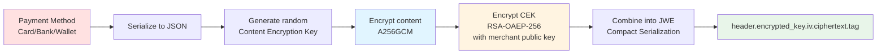
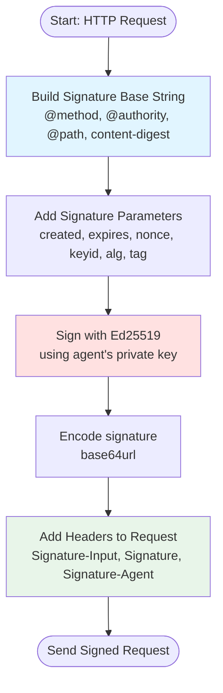
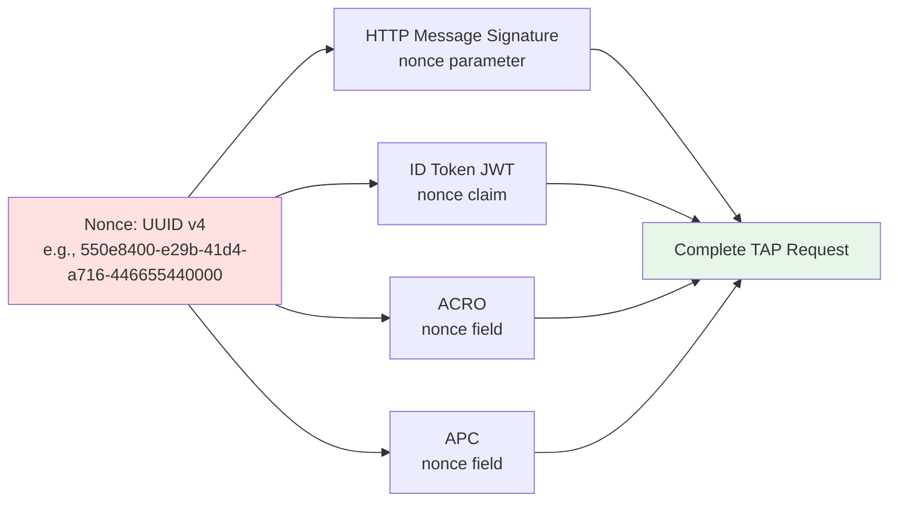

# TAP (Trusted Agent Protocol) Specification

## Overview

The Trusted Agent Protocol (TAP) is Visa's specification for enabling AI agents to securely authenticate with merchants and execute payment transactions on behalf of consumers. This document describes how TAP is implemented in the tap-mcp-bridge project.

## Core Concepts

### 1. Agent Identity

TAP uses Ed25519 public key cryptography for agent identity:

- **Agent ID**: Unique identifier for the agent (e.g., "agent-123")
- **Signing Key**: Ed25519 private key used to sign requests
- **Verifying Key**: Ed25519 public key distributed via JWKS
- **Key ID (kid)**: RFC 7638 JWK Thumbprint of the agent's public key

### 2. HTTP Message Signatures (RFC 9421)

All TAP requests are authenticated using HTTP Message Signatures:

```
Signature-Input: sig1=("@method" "@authority" "@path" "content-digest");
  created=1699564800;expires=1699565280;nonce="uuid-v4";keyid="kid-hash";
  alg="ed25519";tag="agent-browser-auth"
Signature: sig1=:base64url-encoded-signature:
```

**Components signed**:
- `@method`: HTTP method (GET, POST, etc.)
- `@authority`: Host and port from URL
- `@path`: URL path and query string
- `content-digest`: SHA-256 hash of request body (RFC 9530 format)

**Parameters**:
- `created`: Unix timestamp when signature was created
- `expires`: Unix timestamp when signature expires (created + 480 seconds max)
- `nonce`: Unique value per request (UUID v4) for replay protection
- `keyid`: JWK Thumbprint identifying agent's public key
- `alg`: Signature algorithm (always "ed25519" for TAP)
- `tag`: Interaction type ("agent-browser-auth" or "agent-payer-auth")

### 3. Public Key Directory

Agents expose their public keys via JWKS endpoint:

**URL**: `https://{agent-domain}/.well-known/http-message-signatures-directory`

**Format**: RFC 7517 JWKS (JSON Web Key Set)

```json
{
  "keys": [
    {
      "kty": "OKP",
      "crv": "Ed25519",
      "x": "base64url-encoded-public-key",
      "kid": "SHA-256-thumbprint"
    }
  ]
}
```

Merchants fetch this JWKS to verify agent signatures.

## TAP Components

### 1. ID Token (JWT)

JWT containing consumer identity and authentication metadata.

**Structure**:
```json
{
  "header": {
    "alg": "EdDSA",
    "typ": "JWT",
    "kid": "agent-keyid"
  },
  "payload": {
    "iss": "https://agent.example.com",
    "sub": "consumer-123",
    "aud": "https://merchant.example.com",
    "iat": 1699564800,
    "exp": 1699565280,
    "nonce": "uuid-v4"
  },
  "signature": "EdDSA-signature"
}
```

**Purpose**: Proves agent has authenticated the consumer

**Key Fields**:
- `iss`: Agent's domain (issuer)
- `sub`: Consumer identifier
- `aud`: Merchant's domain (audience)
- `nonce`: Must match HTTP signature nonce

**Implementation**: `src/tap/jwt.rs`

### 2. ACRO (Agentic Consumer Recognition Object)

Container for consumer contextual data with agent signature.

**Structure**:
```json
{
  "nonce": "uuid-v4",
  "idToken": "jwt-token",
  "contextualData": {
    "countryCode": "US",
    "zipCode": "94103",
    "ipAddress": "192.0.2.1",
    "deviceData": {
      "userAgent": "Mozilla/5.0...",
      "platform": "MacIntel"
    }
  },
  "kid": "agent-keyid",
  "alg": "ed25519",
  "signature": "base64url-signature"
}
```

**Purpose**: Provides merchant with consumer context for risk assessment

**Signature**: Ed25519 signature over all fields except `signature`

**Implementation**: `src/tap/acro.rs`

### 3. APC (Agentic Payment Container)

Container for encrypted payment credentials with agent signature.

**Structure**:
```json
{
  "nonce": "uuid-v4",
  "encryptedPaymentData": "jwe-compact-serialization",
  "kid": "agent-keyid",
  "alg": "ed25519",
  "signature": "base64url-signature"
}
```

**Payment Data Encryption (JWE)**:



The `encryptedPaymentData` field contains RFC 7516 JWE with:
- **Content Encryption**: A256GCM (AES-256-GCM)
- **Key Encryption**: RSA-OAEP-256 with merchant's public key
- **Format**: JWE Compact Serialization (5 dot-separated parts)

**JWE Structure**:
```
header.encrypted_key.iv.ciphertext.tag
```

**Payment Methods Supported**:
1. **Card**: Card number, expiry, CVV, cardholder name
2. **Bank Account**: Account number, routing number, account type, holder name
3. **Digital Wallet**: Wallet type, wallet token, holder name

**Security**:
- Payment data encrypted before transmission (PCI-DSS compliant)
- Merchant's public key fetched from their JWKS endpoint
- Sensitive data zeroized in memory after encryption
- Defense-in-depth: JWE (application-level) + TLS (transport-level)

**Implementation**: `src/tap/apc.rs`

## Implementation Details

### Signature Generation Flow



**Implementation**:

```rust
// 1. Build signature base string
let sig_base = format!(
    "\"@method\": {}\n\"@authority\": {}\n\"@path\": {}\n\"content-digest\": {}\n\"@signature-params\": {}",
    method, authority, path, content_digest, params
);

// 2. Sign with Ed25519
let signature_bytes = signing_key.sign(sig_base.as_bytes());

// 3. Encode signature
let signature_b64 = base64url::encode(signature_bytes);

// 4. Add headers to request
request.headers.insert("Signature-Input", signature_input);
request.headers.insert("Signature", format!("sig1=:{}", signature_b64));
request.headers.insert("Signature-Agent", agent_directory_url);
```

### JWK Thumbprint Computation (RFC 7638)

```rust
// 1. Create canonical JSON representation
let jwk_json = format!(
    r#"{{"crv":"Ed25519","kty":"OKP","x":"{}"}}"#,
    base64url::encode(public_key_bytes)
);

// 2. Compute SHA-256 hash
let hash = sha256(jwk_json.as_bytes());

// 3. Encode as base64url
let thumbprint = base64url::encode(hash);
```

### Nonce Correlation

TAP requires the same nonce across all components to bind them to a single request:



**Components using the same nonce**:
1. HTTP Message Signature (`nonce` parameter)
2. ID Token JWT (`nonce` claim)
3. ACRO (`nonce` field)
4. APC (`nonce` field)

**Purpose**: This binds all TAP components to a single request, preventing mix-and-match attacks where an attacker could combine components from different requests.

## Security Considerations

### 1. Replay Protection

- Unique nonce (UUID v4) per request
- Merchants must track nonces and reject duplicates
- Nonces should be cached for signature validity window (8 minutes)

### 2. Signature Expiration

- Maximum validity: 480 seconds (8 minutes)
- `expires = created + 480` (TAP requirement)
- Merchants must reject expired signatures

### 3. Timestamp Validation

- `created` must not be too far in the past (e.g., max 5 minutes)
- `created` must not be in the future (clock skew tolerance: ±30 seconds)
- `expires` must be after `created`
- `expires - created ≤ 480 seconds`

### 4. Payment Data Security

- Payment credentials encrypted with JWE before transmission
- Merchant's public key fetched from trusted JWKS endpoint
- Sensitive data (card numbers, CVV) zeroized after encryption
- No plaintext payment data in logs or error messages

### 5. Key Management

- Agent private keys stored securely (HSM, KMS, encrypted vault)
- Public keys distributed via HTTPS-only JWKS endpoint
- Key rotation supported through JWKS updates
- Each key identified by unique JWK Thumbprint (kid)

## Compliance Status

**TAP Compliance**: ✅ 100% (18/18 requirements)

| Requirement | Status | Implementation |
|-------------|--------|----------------|
| RFC 9421 HTTP Signatures | ✅ | `src/tap/signer.rs` |
| Ed25519 Signing | ✅ | Uses `ed25519-dalek` |
| JWK Thumbprint (RFC 7638) | ✅ | `src/tap/jwk.rs` |
| Content-Digest (RFC 9530) | ✅ | SHA-256 hashing |
| Signature Components | ✅ | `@method`, `@authority`, `@path`, `content-digest` |
| Required Parameters | ✅ | `created`, `expires`, `nonce`, `keyid`, `alg`, `tag` |
| Interaction Type Tags | ✅ | `agent-browser-auth`, `agent-payer-auth` |
| Nonce Generation | ✅ | UUID v4 |
| Signature Expiration | ✅ | 480 seconds max |
| Public Key Directory | ✅ | JWKS format |
| ID Token (JWT) | ✅ | `src/tap/jwt.rs` |
| ACRO Structure | ✅ | `src/tap/acro.rs` |
| ACRO Signature | ✅ | Ed25519 over all fields |
| ACRO Contextual Data | ✅ | Country, zip, IP, device |
| APC Structure | ✅ | `src/tap/apc.rs` |
| APC Signature | ✅ | Ed25519 over all fields |
| APC Payment Encryption | ✅ | JWE with A256GCM + RSA-OAEP-256 |
| Nonce Correlation | ✅ | Same nonce across all components |

## References

- **[TAP Specification](https://developer.visa.com/capabilities/trusted-agent-protocol/)**: Official Visa documentation
- **[RFC 9421](https://www.rfc-editor.org/rfc/rfc9421.html)**: HTTP Message Signatures
- **[RFC 7638](https://www.rfc-editor.org/rfc/rfc7638.html)**: JWK Thumbprint
- **[RFC 7516](https://www.rfc-editor.org/rfc/rfc7516.html)**: JSON Web Encryption (JWE)
- **[RFC 9530](https://www.rfc-editor.org/rfc/rfc9530.html)**: Digest Fields (Content-Digest)
- **[RFC 8032](https://www.rfc-editor.org/rfc/rfc8032.html)**: Ed25519 Signature Algorithm
- **[Visa Reference Implementation](https://github.com/visa/trusted-agent-protocol)**: Python reference code
